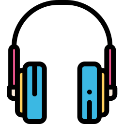

      

<h1 align="center"> Playlist </h1>

    <a href="#demo"> Demonstração</a> •
    <a href="#func"> Funcionalidade</a> •
    <a href="#tec"> Tecnologias</a> •
    <a href="#projeto"> Projeto</a> 
        

<h2 id="demo"> 📷 Demonstração </h2>

<h2 align="center">  </h2>
<h2 align="center">  </h2>

 

<h2 id="func"> ⚙ Funcionalidades </h2>

 - [x] Página totalmente responsiva  
 - [x] Botões de controle totalmente funcionais 
 - [x] Mudança de cor e fundo ao passar de faixa 
 - [x] Design simples e moderno  
 - [x] Imagens e cores correspondentes as faixas musicais    

<h2 id="tec"> 🚀 Tecnologias </h2>

 Esse projeto foi desenvolvido com as seguintes tecnologias: 
 

✔️HTML  
✔️CSS  
✔️Javascript  

<h2 id="projeto"> 💻 Projeto </h2>

Player de música criado com HTML, CSS e Javascript com intuito de treinar as tecnologias citadas.   É possível realizar as seguintes ações: retroceder faixa, iniciar faixa do início, iniciar e pausar, avançar 5 segundos, avançar para próxima faixa, aumentar e dimunir volume e silenciar a música.   O controle de volume não funciona em aparelhos com IOS, apenas a função de silenciar a música ao apertar no ícone de som, isso ocorre devido a uma limitação do sistema IOS.  Site feito em monitor com resolução Quad HD (2560x1440).
 

 

 Criado por Lucas Freitas 🖖🏽| <a href="https://www.linkedin.com/in/lucasfreitas01/"> Faça contato comigo </a> 
 
